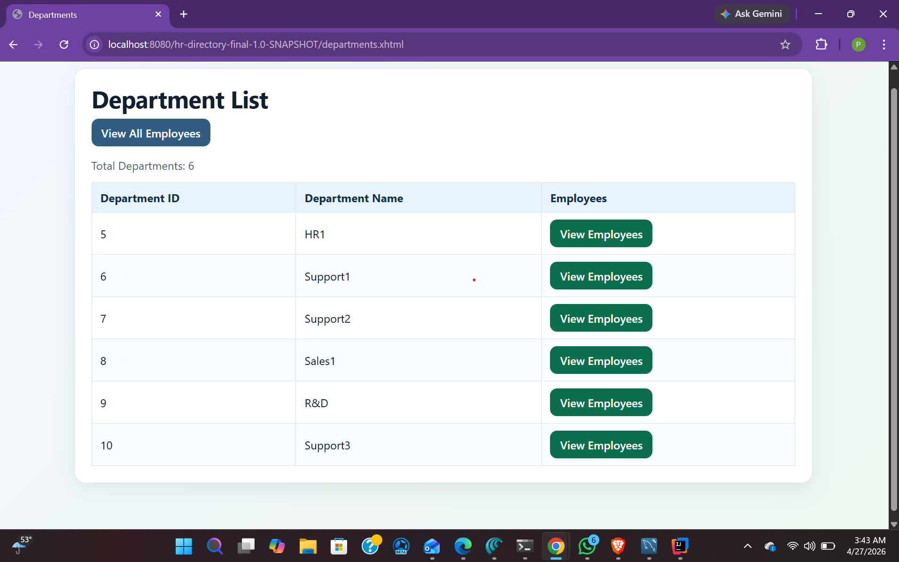
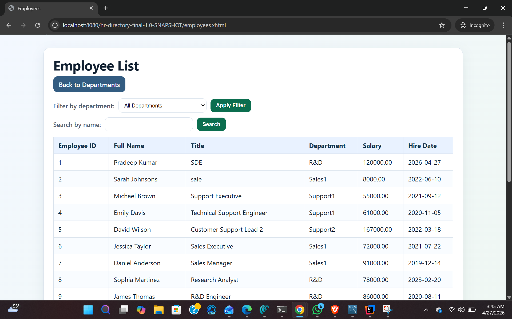
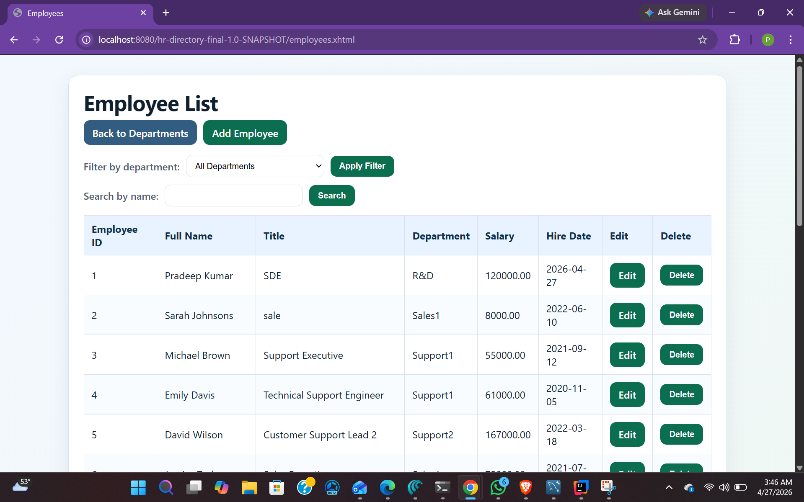
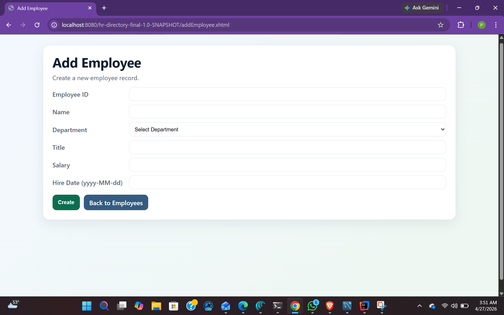
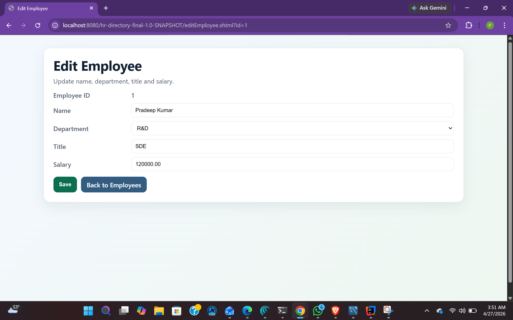
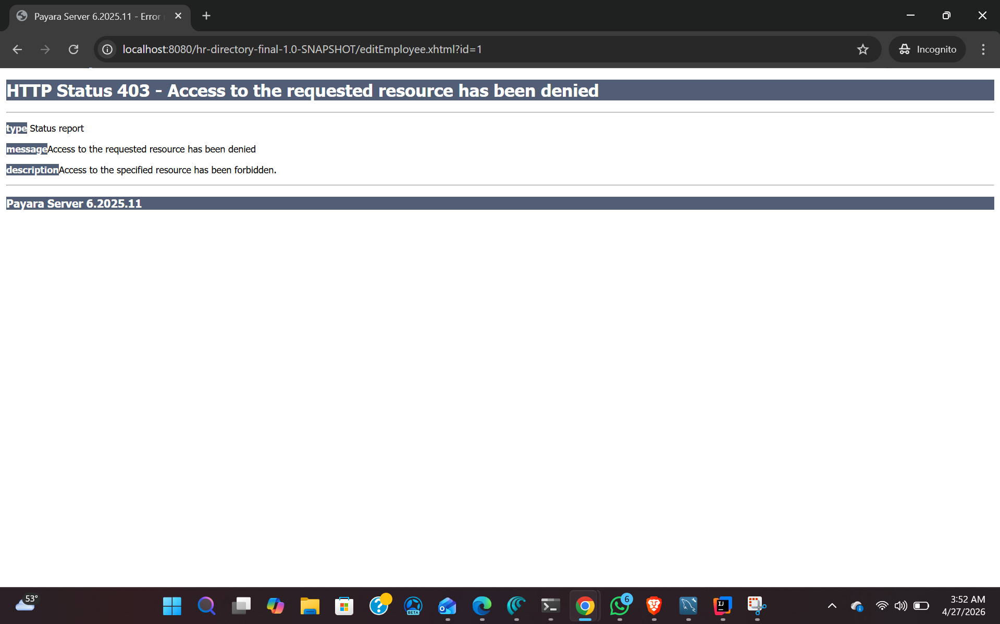
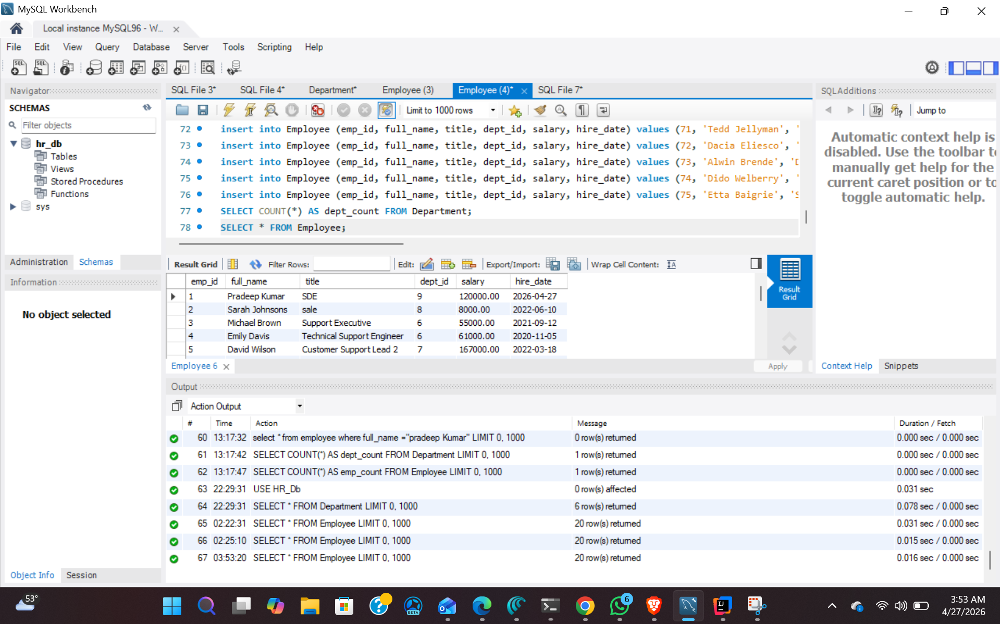
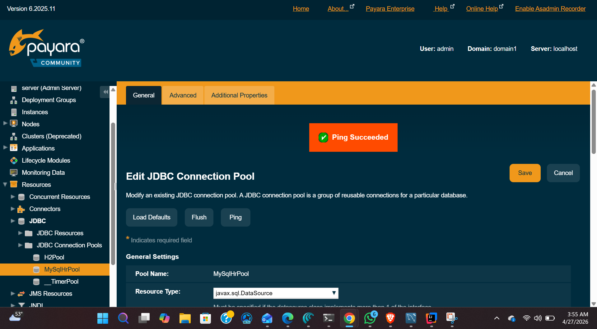

# HR Directory Final Project

This is a Jakarta EE web application for HR directory management using:
- JSF/Facelets for the UI
- JPA/JPQL for persistence
- Stateless EJB service layer for business logic and transactions
- Payara container-managed security (RBAC)

## Features
- Department list page showing `dept_id` and `dept_name`
- Employee list page showing `emp_id`, `full_name`, `title`, `department`, `salary`, `hire_date`
- Employee filtering by department (via department link and dropdown)
- Employee search by name using JPQL named parameter
- ADMIN-only edit flow for employee `title` and `salary`
- JSF validation (`title` required, `salary >= 0`)

## Screenshots
### Department List (USER View)


### Employee List (USER View)


### Employee List (ADMIN View)


### Add Employee (ADMIN View)


### Edit Employee (ADMIN View)


### USER Denied ADMIN Access (403)


### SQL Workbench Data Verification


### Server Ping Succeeded (Payara JDBC Pool)


## Run
1. Configure Payara JDBC resource `jdbc/HrDS` that points to your HR database.
2. Build WAR:
   ```powershell
   .\mvnw.cmd clean package
   ```
3. Deploy `target/hr-directory-final.war` to Payara.
4. Open:
   - `http://localhost:8080/hr-directory-final/departments.xhtml`
   - `http://localhost:8080/hr-directory-final/employees.xhtml`

## Key URLs
- Department list: `/hr-directory-final/departments.xhtml`
- Employee list: `/hr-directory-final/employees.xhtml`
- Edit employee (ADMIN): `/hr-directory-final/editEmployee.xhtml?id=<emp_id>`
